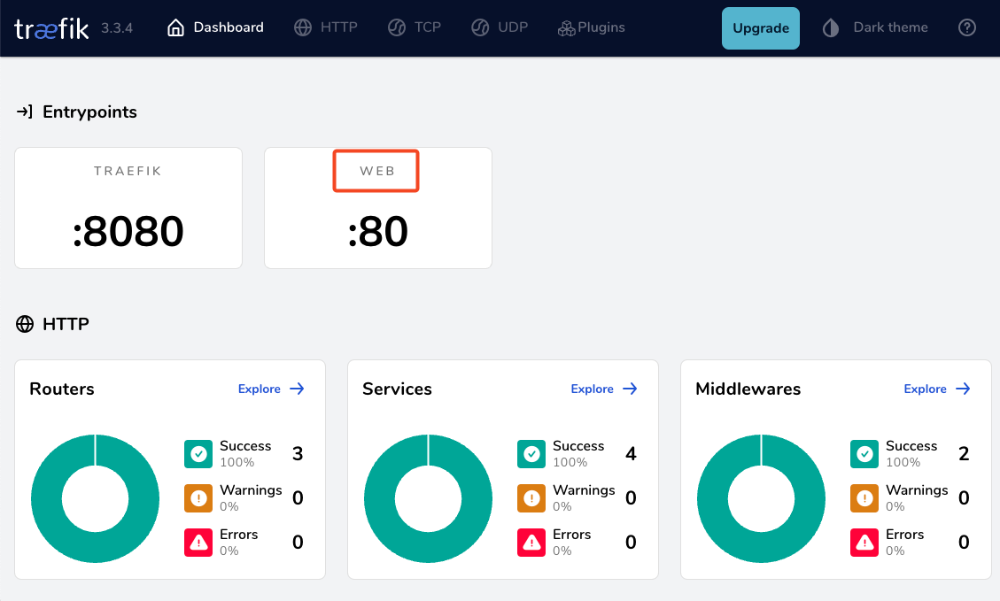
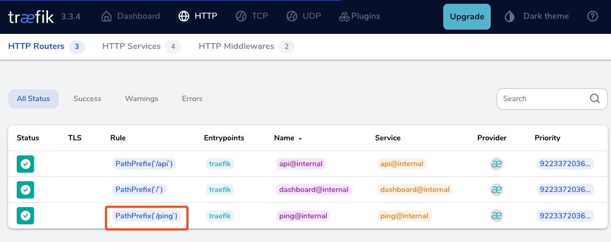
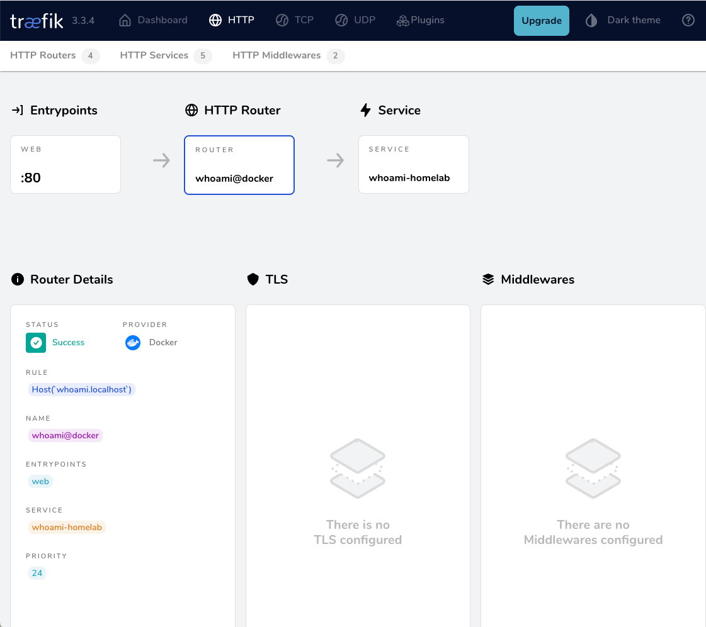

# Introduction to Traefik - Part Two

a blog post series to my homelab


check here for [Introduction to Traefik - Part One](https://github.com/ebal/traefik-intro-01)

check here for [Introduction to Traefik - Part Three](https://github.com/ebal/traefik-intro-03)

## Part Two

In this blog post series, I will connect several docker containers and a virtual machine behind the Traefik reverse proxy on my homelab, and set up Let's Encrypt for TLS. In this post, I will connect our first docker container to the Traefik reverse proxy for testing and to learn how to do this.

I've also made a short video to accompany this blog post:

[](https://youtu.be/GZVjYUNOh-I)

## WhoAmI?

Traefik, whoami is often used as a simple test service to demonstrate how Traefik handles routing, especially when using dynamic routing and reverse proxy setups.

```yaml
  # A container that exposes an API to show its IP address
  whoami:
    image: traefik/whoami
    container_name: whoami
    hostname: whoami

```

our updated docker compose file should look like:

**docker-compose.yml**

```yaml
---
services:
  traefik:
    image: traefik:v3.3
    container_name: traefik
    hostname: traefik
    env_file:
      - path: ./.env
        required: true
    restart: unless-stopped
    ports:
      # The Web UI (enabled by --api.insecure=true)
      - 8080:8080
      # The HTTP port
      - 80:80
    volumes:
      - ./traefik:/etc/traefik
      - /var/run/docker.sock:/var/run/docker.sock:ro

  # A container that exposes an API to show its IP address
  whoami:
    image: traefik/whoami
    container_name: whoami
    hostname: whoami

```

Start all the services

```bash
docker compose up -d
```

output:

```
$ docker compose up -d
[+] Running 3/3
 ✔ Network homelab_default  Created    0.3s
 ✔ Container whoami         Started    2.2s
 ✔ Container traefik        Started    2.3s
```

### Test WhoAmI - the wrong way

We can test our traefik reverse proxy with

```bash
curl -H Host:whoami.localhost http://127.0.0.1
```

but the result should be:

```
404 page not found
```

**Why ?**

We have not yet changed our traefik configuration file to enable an EntryPoint. EntryPoints are the network entry points into Traefik.

So let's go back one step.


```bash
docker compose down

```

## Traefik Configuration

The simplest approach is to update our configuration file and add a new EntryPoint. However, I’d like to take this opportunity to expand our configuration a little.

EntryPoints are Static Configuration, so they must be included on traefik.yml file.

```yaml
## Static configuration
entryPoints:
  web:
   address: ":80"
```

so **traefik/traefik.yml** should look like:

```yaml
# API and dashboard configuration
api:
  insecure: true

## Static configuration
entryPoints:
  web:
   address: ":80"
```

That should work, but given the opportunity, let's enhance our Traefik configuration by including:

### Ping

```yaml
# The /ping health-check URL
ping: {

}
```

It would be useful to add a health check in the Docker Compose file later on.

### Logs

This is how to enable the DEBUG (or INFO - just replace the verb in level)

```yaml
# Debug log
log:
  filePath: /etc/traefik/traefik.log
  level: DEBUG

```

### Docker provider

I want to explicitly include the Docker provider with a caveat: I don’t want to automatically expose all my docker containers behind Traefik. Instead, I prefer to manually add each docker container that I want to expose to the internet, rather than exposing all of them by default.

```yaml
providers:
  # Enable docker provider
  docker: {
    exposedByDefault: false
  }
  
```

## Traefik Configuration file updated

and now **traefik/traefik.yml** looks like:

```yaml
# The /ping health-check URL
ping: {

}

# API and dashboard configuration
api:
    insecure: true

# Debug log
log:
    filePath: /etc/traefik/traefik.log
    level: DEBUG

# Enable EntryPoints
entryPoints:
    web:
        address: ":80"
        reusePort: true

# Providers
providers:
    # Enable docker provider
    docker: {
        exposedByDefault: false
    }

```

by running 

```bash
docker compose up traefik -d
```

we can review Traefik dashboard with the new web EntryPoint and ping





## WhoAmI - the correct way

okay, we now have our EntryPoint in Traefik but we need to explicit expose our whoami docker container and in order to do that, we need to add some labels!

```yaml
  # A container that exposes an API to show its IP address
  whoami:
    image: traefik/whoami
    container_name: whoami
    hostname: whoami
    labels:
        - "traefik.enable=true" # To enable whoami to Traefik
        - "traefik.http.routers.whoami.rule=Host(`whoami.localhost`)" # Declare the host rule for this service
        - "traefik.http.routers.whoami.entrypoints=web" # Declare the EntryPoint
```

let's put everything together:

```yaml
---
services:
  traefik:
    image: traefik:v3.3
    container_name: traefik
    hostname: traefik
    env_file:
      - path: ./.env
        required: true
    restart: unless-stopped
    ports:
      # The Web UI (enabled by --api.insecure=true)
      - 8080:8080
      # The HTTP port
      - 80:80
    volumes:
      - ./traefik:/etc/traefik
      - /var/run/docker.sock:/var/run/docker.sock:ro

  # A container that exposes an API to show its IP address
  whoami:
    image: traefik/whoami
    container_name: whoami
    hostname: whoami
    labels:
        - "traefik.enable=true" # To enable whoami to Traefik
        - "traefik.http.routers.whoami.rule=Host(`whoami.localhost`)" # Declare the host rule for this service
        - "traefik.http.routers.whoami.entrypoints=web" # Declare the EntryPoint

```

`docker compose up -d`

### Test Who Am I

```bash
curl -H Host:whoami.localhost http://127.0.0.1
```

output:

```
Hostname: whoami
IP: 127.0.0.1
IP: ::1
IP: 172.19.0.3
RemoteAddr: 172.19.0.2:41276
GET / HTTP/1.1
Host: whoami.localhost
User-Agent: curl/8.12.1
Accept: */*
Accept-Encoding: gzip
X-Forwarded-For: 172.19.0.1
X-Forwarded-Host: whoami.localhost
X-Forwarded-Port: 80
X-Forwarded-Proto: http
X-Forwarded-Server: traefik
X-Real-Ip: 172.19.0.1
```

## Health Checks and Depends

before finishing this article, I would like to include two more things.

### Traefik Health Check

We added above the **ping** section on Traefik configuration, it is time to use it. On our docker compose configuration file, we can add a health check section for Traefik service.

We can test this from our command line

```bash
curl -s --fail http://127.0.0.1:8080/ping
```

the result should be an **OK** !

and we can extend the Traefik service to include this

```yaml
    healthcheck:
      test: curl -s --fail http://127.0.0.1:8080/ping
      interval: 30s
      retries: 3
      timeout: 10s
      start_period: 10s

```

### Depends On

The above health check option can be used to specify service dependencies in docker compose, so we can ensure that the whoami docker service starts after Traefik. 

```yaml
    depends_on:
      - traefik
```

that means our docker compose yaml file should look like:

```yaml
---
services:
  traefik:
    image: traefik:v3.3
    container_name: traefik
    hostname: traefik
    env_file:
      - path: ./.env
        required: true
    restart: unless-stopped
    ports:
      # The Web UI (enabled by --api.insecure=true)
      - 8080:8080
      # The HTTP port
      - 80:80
    volumes:
      - ./traefik:/etc/traefik
      - /var/run/docker.sock:/var/run/docker.sock:ro
    # Add health check
    healthcheck:
      test: curl -s --fail http://127.0.0.1:8080/ping
      interval: 30s
      retries: 3
      timeout: 10s
      start_period: 10s

  # A container that exposes an API to show its IP address
  whoami:
    image: traefik/whoami
    container_name: whoami
    hostname: whoami
    depends_on:
      - traefik
    labels:
        - "traefik.enable=true"                                       # To enable whoami to Traefik
        - "traefik.http.routers.whoami.rule=Host(`whoami.localhost`)" # Declare the host rule for this service
        - "traefik.http.routers.whoami.entrypoints=web"               # Declare the EntryPoint

```


